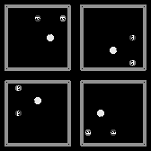

### TP-Final-Procesos-Markovianos-para-el-Aprendizaje-Automatico-2019-1C
Continues from here: https://github.com/LecJackS/Procesos-Markovianos-Para-el-Aprendizaje-Automatico-2019-1C/

### Very Quick Roadmap to
# Asynchronous Advantage Actor Critic (A3C)

* All explanation is in [the main notebook](Very%quick%roadmap%to%Asynchronous%Advantage%Actor%Critic.ipynb)

* All action is divided in two pacman_folders:
  1. cs188x_pacman: with Berkeley's Pac-man simulator and two functional Q-agents
    
  2. gym_pacman: also with Berkeley's Pac-man with almost complete portability to Gym environments.
     
     Basically all the action is in the 2nd one, so you may want to pay attention to:
     
     *train.py* and *process.py* (heavely commented)
     
     *GraphicsUtils.py* for doing something more clever with the non-optional rendering of the game, 16 windows can be a lot! (right now I moved them 600 pixels) to the left of the screen)
     
     *Pacman_env* for tweaking layouts chosen, ghosts, pellets.
     
     